# Reticular Epistemic Inference Model (REIM)

### A Computational Framework for Inferring System Truth from Distributed Noisy Observations

**Author:** Mariano Viola **Version:** 1.0 — March 2026

---

## Table of Contents

1. [Origins and Philosophical Foundation](https://claude.ai/chat/2a623e88-faff-455c-a482-0450c7ad270f#1-origins-and-philosophical-foundation)
2. [From Epistemology to Computation](https://claude.ai/chat/2a623e88-faff-455c-a482-0450c7ad270f#2-from-epistemology-to-computation)
3. [Base REIM: Mathematical Framework](https://claude.ai/chat/2a623e88-faff-455c-a482-0450c7ad270f#3-base-reim-mathematical-framework)
4. [Hierarchical REIM (H-REIM)](https://claude.ai/chat/2a623e88-faff-455c-a482-0450c7ad270f#4-hierarchical-reim-h-reim)
5. [Online REIM](https://claude.ai/chat/2a623e88-faff-455c-a482-0450c7ad270f#5-online-reim)
6. [MultiDimensionalREIM: Platform Integration](https://claude.ai/chat/2a623e88-faff-455c-a482-0450c7ad270f#6-multidimensionalreim-platform-integration)
7. [Experimental Results](https://claude.ai/chat/2a623e88-faff-455c-a482-0450c7ad270f#7-experimental-results)
8. [Related Work and Positioning](https://claude.ai/chat/2a623e88-faff-455c-a482-0450c7ad270f#8-related-work-and-positioning)
9. [Strategic Vision](https://claude.ai/chat/2a623e88-faff-455c-a482-0450c7ad270f#9-strategic-vision)
10. [Limitations and Future Directions](https://claude.ai/chat/2a623e88-faff-455c-a482-0450c7ad270f#10-limitations-and-future-directions)

---

## 1. Origins and Philosophical Foundation

### 1.1 The Reticular Theory of Reality

REIM originates from the **Reticular Theory of Reality** (_Teoria Reticolare della Realtà_), a philosophical framework formulated by Mariano Viola that describes the structure of knowledge in complex systems through ten axioms.

The theory starts from a fundamental observation: **observers located inside a complex system must infer its properties from incomplete and noisy local observations**. This condition is universal — it applies to cosmological observation, scientific measurement, distributed sensing, and collective intelligence.

### 1.2 The Ten Axioms

The axioms are organized in three conceptual blocks.

**Ontological block — The structure of reality (Axioms 1–4)**

| #   | Axiom                      | Statement                                                                                                                          |
| --- | -------------------------- | ---------------------------------------------------------------------------------------------------------------------------------- |
| 1   | **Reticularity**           | Reality is structured as a complex reticular system composed of interconnected elements from which structures and dynamics emerge. |
| 2   | **System Emergence**       | From the fundamental reticulum, organized systems emerge that possess properties not reducible to their individual components.     |
| 3   | **Level Generation**       | Each system can generate subsystems or organizational levels that develop from its structure.                                      |
| 4   | **Subsystem Multiplicity** | A system can generate multiple subsystems simultaneously, which may evolve relatively independently.                               |

**Phenomenological block — Consciousness and observation (Axioms 5–6)**

|#|Axiom|Statement|
|---|---|---|
|5|**Consciousness Emergence**|In some sufficiently complex systems, consciousness emerges — understood as the capacity to recognize oneself and observe the containing system.|
|6|**Origin-Oriented Awareness**|A conscious system can know itself and partially the system that contains it, but cannot fully know the system that will emerge from it.|

**Epistemic block — The limits of knowledge (Axioms 7–10)**

|#|Axiom|Statement|
|---|---|---|
|7|**Epistemic Hierarchy**|Knowledge of reality is organized in epistemic levels; each level has access only to a limited portion of the overall structure.|
|8|**Observability Horizons**|Every observing system is limited by two epistemic horizons: vertical (limit in knowing the containing system) and horizontal (limit in perceiving coexisting but independent systems).|
|9|**Relative Subsystem Autonomy**|Subsystems generated from the same reticulum can develop independent dynamics while sharing the same fundamental substrate.|
|10|**Internal Knowledge Incompleteness**|An observer internal to a system cannot definitively demonstrate the ultimate structure of the reality that contains it.|

### 1.3 Synthetic Formula

> _Reality is a complex reticulum from which hierarchical systems emerge. Some of these develop consciousness and observation, but every observer remains limited by epistemic horizons that prevent complete knowledge of the structure that generates it._

Or in compact form:

$$\text{reality} = \text{reticulum} \rightarrow \text{hierarchy} \rightarrow \text{consciousness} \rightarrow \text{epistemic horizons}$$

---

## 2. From Epistemology to Computation

### 2.1 The Translation

The ten axioms translate into a set of computational principles that define the REIM framework:

```mermaid
flowchart TD
    A1["Axiom 1: Reticularity"] --> C1["Bipartite graph:\nobservers ↔ systems"]
    A2["Axiom 2: Emergence"] --> C2["Properties emerge\nfrom component aggregation"]
    A3["Axiom 3: Level Generation"] --> C3["Multi-level hierarchy\nK levels"]
    A4["Axiom 4: Multiplicity"] --> C4["Multiple children per node\ntree/DAG structure"]
    A5["Axiom 5: Consciousness"] --> C5["Observers positioned\nat specific levels"]
    A6["Axiom 6: Directional Awareness"] --> C6["Observe self + above\nnot below"]
    A7["Axiom 7: Epistemic Hierarchy"] --> C7["Level-dependent\nknowledge access"]
    A8["Axiom 8: Horizons"] --> C8["Vertical attenuation\n+ horizontal limits"]
    A9["Axiom 9: Autonomy"] --> C9["Independent branches\nin the hierarchy"]
    A10["Axiom 10: Incompleteness"] --> C10["Cannot estimate θ\nfor levels below observer"]

    style A1 fill:#e3f2fd,stroke:#1565c0
    style A2 fill:#e3f2fd,stroke:#1565c0
    style A3 fill:#e3f2fd,stroke:#1565c0
    style A4 fill:#e3f2fd,stroke:#1565c0
    style A5 fill:#fce4ec,stroke:#c62828
    style A6 fill:#fce4ec,stroke:#c62828
    style A7 fill:#e8f5e9,stroke:#2e7d32
    style A8 fill:#e8f5e9,stroke:#2e7d32
    style A9 fill:#e8f5e9,stroke:#2e7d32
    style A10 fill:#e8f5e9,stroke:#2e7d32
    style C1 fill:#fff,stroke:#333
    style C2 fill:#fff,stroke:#333
    style C3 fill:#fff,stroke:#333
    style C4 fill:#fff,stroke:#333
    style C5 fill:#fff,stroke:#333
    style C6 fill:#fff,stroke:#333
    style C7 fill:#fff,stroke:#333
    style C8 fill:#fff,stroke:#333
    style C9 fill:#fff,stroke:#333
    style C10 fill:#fff,stroke:#333
```

### 2.2 The Generative Rules

Nine conceptual rules bridge the axioms to the model:

1. **A real system exists** with properties independent of observers → $\theta_p$
2. **Observers are internal** to the system → limited, local knowledge
3. **Each observer sees only a portion** of reality → observation set $\Omega(u)$
4. **Observations are imperfect** → $r_{u,p} = \theta_p + \epsilon_{u,p}$
5. **Observers have different reliability** → $\alpha_u = 1/\sigma_u^2$
6. **Truth emerges from interaction** among observations → weighted aggregation
7. **Reliability can be inferred** from consistency → self-correcting mechanism
8. **The process is iterative** → alternating updates of $\theta$ and $\sigma^2$
9. **The system converges** → monotone log-likelihood, stationary point

### 2.3 Model Variants

```mermaid
graph TD
    REIM["REIM Framework"] --> BASE["Base REIM"]
    REIM --> HREIM["H-REIM"]
    REIM --> ONLINE["Online REIM"]
    REIM --> CONS["MultiDimensionalREIM"]

    BASE --> MLE["MLE Variant"]
    BASE --> BAY["Bayesian MAP Variant"]

    HREIM --> EMR["Bottom-up Emergence"]
    HREIM --> DIR["Directional Observability"]
    HREIM --> ATT["Vertical Attenuation"]

    ONLINE --> INC["Incremental Updates"]
    ONLINE --> WS["Warm Start from Batch"]
    ONLINE --> RCL["Periodic Recalibration"]

    CONS --> JRN["Multi-phase Analysis"]
    CONS --> USG["Category-specific Criteria"]
    CONS --> TMP["Temporal Decay"]
    CONS --> TAX["Configurable Domains"]

    style REIM fill:#1565c0,stroke:#0d47a1,color:#fff
    style BASE fill:#42a5f5,stroke:#1565c0,color:#fff
    style HREIM fill:#42a5f5,stroke:#1565c0,color:#fff
    style ONLINE fill:#42a5f5,stroke:#1565c0,color:#fff
    style CONS fill:#42a5f5,stroke:#1565c0,color:#fff
```

---

## 3. Base REIM: Mathematical Framework

### 3.1 Problem Formulation

Consider $P$ systems and $U$ observers. System $p$ has unknown true property $\theta_p \in \mathbb{R}$. Observer $u$ produces observations:

$$r_{u,p} = \theta_p + \epsilon_{u,p}, \quad \epsilon_{u,p} \sim \mathcal{N}(0, \sigma_u^2)$$

The precision $\alpha_u = 1/\sigma_u^2$ is the observer's reliability. Both $\theta_p$ and $\sigma_u^2$ are unknown.

### 3.2 Maximum Likelihood Estimation

The log-likelihood is:

$$\mathcal{L}(\boldsymbol{\theta}, \boldsymbol{\sigma}^2) = -\frac{1}{2} \sum_{u,p} \left[ \frac{(r_{u,p} - \theta_p)^2}{\sigma_u^2} + \log \sigma_u^2 \right]$$

**System property update** (fixing $\sigma_u^2$):

$$\hat{\theta}_p = \frac{\sum_u \alpha_u , r_{u,p}}{\sum_u \alpha_u}$$

**Observer variance update** (fixing $\theta_p$):

$$\hat{\sigma}_u^2 = \frac{1}{|P_u|} \sum_{p \in P_u} (r_{u,p} - \hat{\theta}_p)^2$$

### 3.3 Convergence

**Proposition.** The iterative REIM algorithm, as coordinate ascent on $\mathcal{L}$, produces a monotonically non-decreasing sequence of log-likelihood values and converges to a stationary point.

**Proof sketch.** Each step maximizes $\mathcal{L}$ with respect to one parameter block while holding the other fixed. Since each update is a closed-form maximizer, $\mathcal{L}$ cannot decrease. The sequence is bounded above (finite observations) and monotonically non-decreasing, hence converges. The limit satisfies first-order optimality for both blocks.

### 3.4 Bayesian Extension (MAP)

With priors $\theta_p \sim \mathcal{N}(\mu_0, \tau_0^2)$ and $\sigma_u^2 \sim \text{Inv-Gamma}(a_0, b_0)$:

$$\hat{\theta}_p^{\text{MAP}} = \frac{\tau_0^{-2}\mu_0 + \sum_u \alpha_u , r_{u,p}}{\tau_0^{-2} + \sum_u \alpha_u}$$

This provides **regularization** (systems with few observations shrink toward $\mu_0$) and **uncertainty quantification**:

$$\text{SE}(\hat{\theta}_p) = \frac{1}{\sqrt{\tau_0^{-2} + \sum_u \alpha_u}}$$

### 3.5 Algorithm

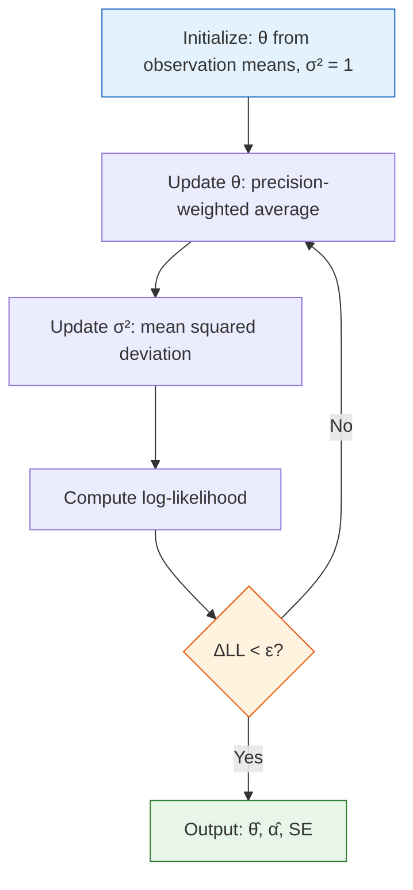

---

## 4. Hierarchical REIM (H-REIM)

### 4.1 Motivation

The base REIM operates on a single level. Many real-world systems have intrinsic hierarchical structure where properties at higher levels emerge from lower-level components. H-REIM extends the framework to capture this structure, translating Axioms 2–3 (emergence, level generation) and Axioms 6–8 (directional observability, epistemic horizons) into formal mechanisms.

### 4.2 Hierarchical Structure

Systems are organized on $K$ levels. Level 0 is the most abstract (e.g., university); the highest level is the most granular (e.g., courses).

```mermaid
graph TD
    U["University\nLevel 0"] --> F1["Faculty A\nLevel 1"]
    U --> F2["Faculty B\nLevel 1"]
    F1 --> D1["Department 1\nLevel 2"]
    F1 --> D2["Department 2\nLevel 2"]
    F2 --> D3["Department 3\nLevel 2"]
    F2 --> D4["Department 4\nLevel 2"]
    D1 --> C1["Course 1\nLevel 3"]
    D1 --> C2["Course 2\nLevel 3"]
    D2 --> C3["Course 3\nLevel 3"]
    D2 --> C4["Course 4\nLevel 3"]

    O_S["👤 Students\nLevel 3"] -.->|"observe"| C1
    O_S -.-> C2
    O_S -.->|"observe (attenuated)"| D1
    O_DH["👤 Dept Heads\nLevel 2"] -.->|"observe"| D1
    O_DH -.->|"observe (attenuated)"| F1
    O_D["👤 Deans\nLevel 1"] -.->|"observe"| F1
    O_D -.->|"observe (attenuated)"| U

    style U fill:#1565c0,color:#fff
    style F1 fill:#42a5f5,color:#fff
    style F2 fill:#42a5f5,color:#fff
    style D1 fill:#90caf9
    style D2 fill:#90caf9
    style D3 fill:#90caf9
    style D4 fill:#90caf9
    style C1 fill:#bbdefb
    style C2 fill:#bbdefb
    style C3 fill:#bbdefb
    style C4 fill:#bbdefb
    style O_S fill:#fff9c4,stroke:#f9a825
    style O_DH fill:#fff9c4,stroke:#f9a825
    style O_D fill:#fff9c4,stroke:#f9a825
```

### 4.3 Emergence Function

Properties at level $k$ emerge from level $k+1$:

$$\theta_p^{(k)} = g\left({\theta_j^{(k+1)} : j \in \text{children}(p)}\right) + \eta_p^{(k)}$$

where $g$ is an aggregation function and $\eta$ is stochastic emergence noise, capturing Axiom 2 — emergent properties are not fully reducible to components.

### 4.4 Directional Observability (Axiom 6)

Observer $u$ at level $\ell(u)$ can observe:

$$\Omega(u) = {p^{(k)} : k \leq \ell(u)} \cap H(u)$$

where $H(u)$ is the horizontal horizon. Observers see their level and above, never below.

### 4.5 Vertical Attenuation (Axiom 8)

Observation noise increases with hierarchical distance:

$$\sigma_{u,k}^2 = \sigma_u^2 \cdot \phi^{(\ell(u) - k)}, \quad \phi > 1$$

Systems far above the observer are seen with progressively less precision.

### 4.6 Four-Phase Inference

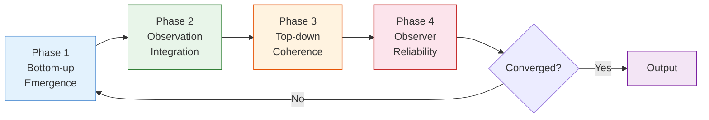

1. **Bottom-up emergence:** propagate property estimates upward via $g$
2. **Observation integration:** combine direct observations (attenuated by distance) with emerged estimates
3. **Top-down coherence:** soft constraint pulling parent estimates toward emerged values
4. **Observer reliability update:** as in base REIM

---

## 5. Online REIM

### 5.1 Motivation

The batch REIM requires all observations upfront and iterates until convergence. In production systems (e.g., a review platform), observations arrive continuously. Online REIM processes each new observation in $O(1)$ time, maintaining running estimates that improve incrementally.

### 5.2 Sufficient Statistics

For each system, maintain:

$$W_p = \sum_u \alpha_u , r_{u,p}, \quad T_p = \sum_u \alpha_u$$

The current estimate is $\hat{\theta}_p = W_p / T_p$. A new observation updates $W_p$ and $T_p$ with a single addition.

### 5.3 Observer Precision Update

Observer variance is tracked via exponential moving average:

$$\hat{\sigma}_u^2 \leftarrow (1 - \lambda),\hat{\sigma}_u^2 + \lambda,(r_{u,p} - \hat{\theta}_p)^2$$

where $\lambda$ is the learning rate.

### 5.4 Periodic Recalibration

Every $N$ observations, a full recalibration recomputes system estimates from the observation log using current observer precisions. This closes the gap with the batch solution by emulating one iteration of coordinate ascent.

### 5.5 Warm Start

An Online REIM instance can be initialized from a fitted batch model, inheriting system estimates and observer precisions. This enables a hybrid strategy:

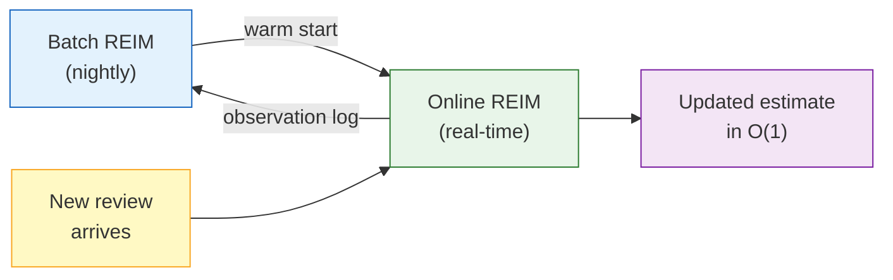

---

## 6. MultiDimensionalREIM: Platform Integration

### 6.1 Platform Structure

MultiDimensionalREIM is designed for review platforms with rich multi-dimensional review structures:

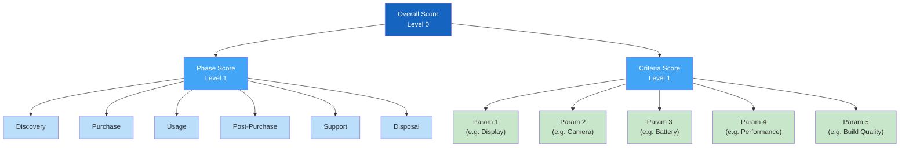

### 6.2 Key Features

- **Configurable lifecycle phases:** e.g., discovery, purchase, usage, post-purchase, support, disposal — each with a phase rating (1–5)
- **Domain-specific criteria:** configurable per product category, each with evaluation dimensions
- **Temporal reviews:** observers log experiences repeatedly over months/years
- **Temporal decay:** $\alpha_{u,t} = \alpha_u \cdot \lambda^{(T-t)}$ weights recent observations more heavily

### 6.3 Taxonomy Scale

|Macro-Category|Sub-Categories|Example Products|
|---|---|---|
|Technology|13|Smartphone, Laptop, Camera, Smartwatch|
|Home & Kitchen|13|Robot vacuum, Coffee machine, Air fryer|
|Personal Care|7|Hair dryer, Electric shaver, Skincare|
|Furniture & Comfort|4|Mattress, Office chair, Standing desk|
|Fashion & Accessories|4|Running shoes, Backpack, Luggage|
|Urban Mobility|2|E-bike, Electric scooter|
|Children & Family|3|Car seat, Stroller, Educational toy|
|Outdoor & Sports|30|Tent, Hiking boots, Mountain bike, Surfboard|

### 6.3 Integration Architecture

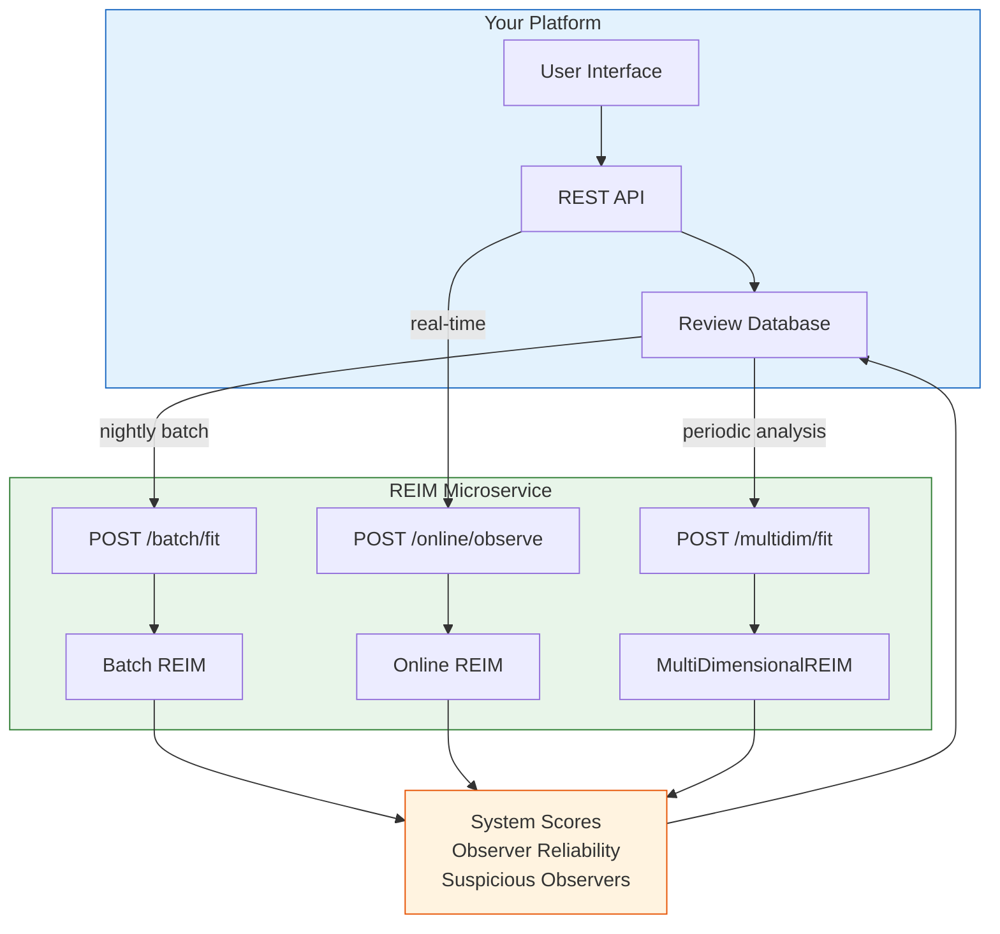

---

## 7. Experimental Results

### 7.1 Base REIM

|Metric|Simple Average|Trimmed Mean|Median|REIM (MLE)|REIM (Bayesian)|
|---|---|---|---|---|---|
|RMSE|0.485|0.354|0.103|**0.032**|0.043|
|Kendall τ|0.961|0.968|0.981|**0.986**|0.985|
|Pearson r|0.998|0.999|0.999|**0.9998**|0.9997|

_50 systems, 200 observers, 20% adversarial. REIM MLE achieves 93% RMSE reduction vs simple average._

### 7.2 Robustness to Adversarial Observers

|Adversarial %|Simple Average|REIM (MLE)|REIM (Bayesian)|
|---|---|---|---|
|0%|0.074|0.028|0.033|
|20%|0.498|0.034|0.045|
|40%|0.936|**0.044**|0.067|

_REIM remains nearly flat while simple averaging degrades linearly._

### 7.3 H-REIM: Hierarchical Advantage

|Level|Systems|Simple Avg|Flat REIM|H-REIM|
|---|---|---|---|---|
|3 (Courses)|100|0.285|0.213|0.214|
|2 (Departments)|20|0.234|0.205|**0.160**|
|1 (Faculties)|5|0.150|0.132|**0.109**|
|0 (University)|1|0.309|0.325|**0.283**|

_H-REIM shows +22% improvement at intermediate levels where two information flows converge._

### 7.4 Review Platform Demo

|Metric|Value|
|---|---|
|RMSE (all products, all dimensions)|0.076|
|RMSE reduction vs simple average|80%|
|Fake reviewer detection — Precision|100%|
|Fake reviewer detection — Recall|75%|
|Fake reviewer detection — F1|85.7%|

### 7.5 MultiDimensionalREIM

|Metric|Value|
|---|---|
|RMSE (11 smartphone dimensions)|0.102|
|Dimensions within ±0.2 of truth|91%|
|Observer types correctly ranked|Yes|

### 7.6 Online REIM

|Metric|Value|
|---|---|
|Processing speed|~16,000 obs/sec|
|Final RMSE (after 1800 obs)|0.114|
|Gap vs batch REIM|0.039|
|RMSE reduction vs simple average|72%|

---

## 8. Related Work and Positioning

### 8.1 Landscape

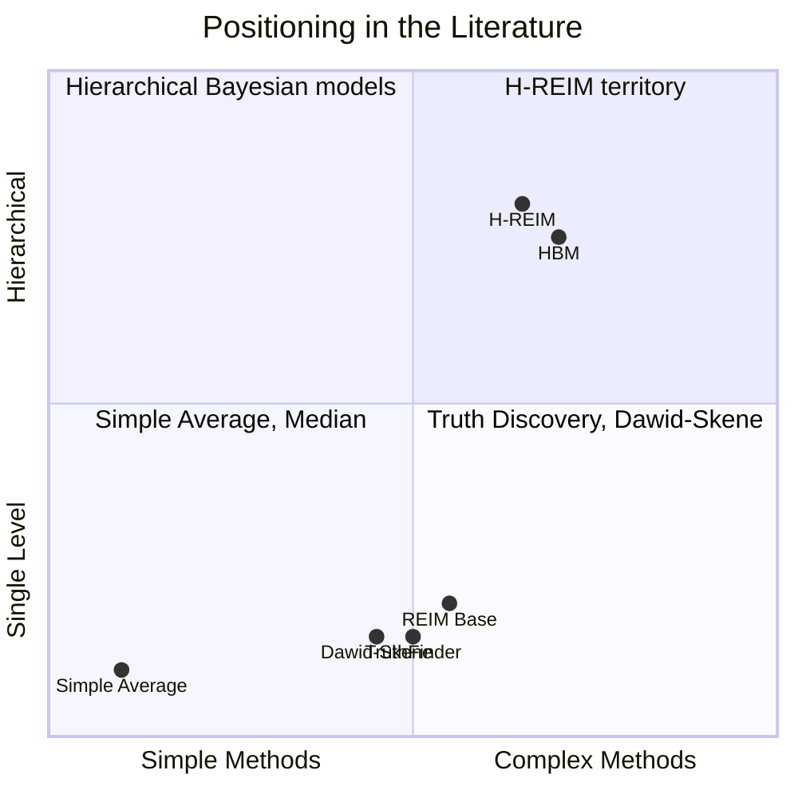

### 8.2 Key Differentiators

**vs Truth Discovery (TruthFinder, Sums, etc.):** REIM shares the iterative structure but provides an explicit probabilistic generative model, convergence guarantees, and Bayesian uncertainty quantification. Most truth discovery methods use heuristic update rules.

**vs Dawid-Skene:** Operates in the categorical domain; REIM handles continuous ratings with uncertainty estimates.

**vs Hierarchical Bayesian Models:** Standard HBMs assume top-down generation. H-REIM combines bottom-up emergence with directional observability constraints — a structure motivated by epistemic principles rather than statistical convenience.

**vs Robust Aggregation (trimmed mean, median):** These don't learn observer-specific reliability and fail under systematic (non-random) adversarial behavior.

### 8.3 The Novel Contribution

The combination of **hierarchical emergence, directional observability constraints, and vertical attenuation** in H-REIM is, to our knowledge, not formalized in the existing truth discovery or crowdsourcing literature. This structure is derived from epistemological principles (the ten axioms) rather than engineering heuristics, giving it a coherent theoretical foundation.

---

## 9. Strategic Vision

### 9.1 Product Strategy

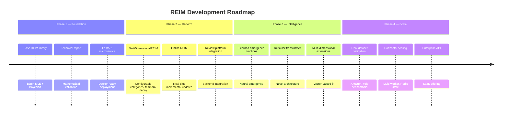

### 9.2 Market Applications

|Application|Model|Value Proposition|
|---|---|---|
|**Review platforms**|Base + MultiDim|True system quality, fake detection|
|**Crowdsourcing / Data labeling**|Base (Bayesian)|Annotator quality, label confidence|
|**Institutional evaluation**|H-REIM|Multi-level quality assessment|
|**Distributed sensor networks**|Base (Online)|Real-time calibration, fault detection|
|**Supply chain quality**|H-REIM|Hierarchical defect localization|
|**Scientific consensus**|Base (Bayesian)|Weighted meta-analysis|

### 9.3 Competitive Moat

1. **Theoretical foundation.** The axiomatic grounding gives REIM a coherent identity that pure engineering approaches lack. Design choices are principled, not ad hoc.
2. **Hierarchical extension.** H-REIM with directional observability is a novel contribution with no direct competitor in the truth discovery space.
3. **Full-stack delivery.** From mathematical framework to Python library to Docker microservice — the gap between theory and production is already closed.
4. **Domain-specific adaptation.** MultiDimensionalREIM with configurable phase types and criteria is not a generic tool — it's a purpose-built solution for structured review analysis adaptable to any domain.

---

## 10. Limitations and Future Directions

### 10.1 Current Limitations

- **Gaussian noise assumption.** Real-world noise may be heavy-tailed, multi-modal, or asymmetric.
- **Stationary properties.** Products degrade, services improve — $\theta_p$ should evolve. Temporal decay partially addresses this, but a fully dynamic model would be stronger.
- **Pre-defined hierarchy.** H-REIM requires a known hierarchy structure. Learning the hierarchy from data is an open problem.
- **Synthetic validation.** All experiments use synthetic data with known ground truth. Real-world validation on public datasets is the critical next step.
- **Single-worker online state.** Online REIM instances are in-memory and not shared across workers.

### 10.2 Research Directions

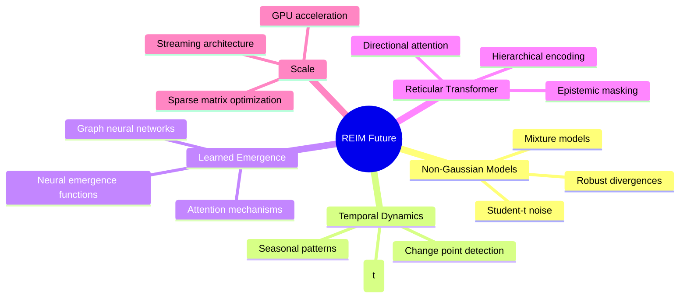

### 10.3 The Reticular Transformer

The most ambitious future direction: an attention-based architecture where the attention pattern is constrained by the epistemic geometry of the problem. Each "head" corresponds to an observer with a specific position in the hierarchy, attending only to systems within its observability cone. This would translate the ten axioms directly into a neural architecture — not a generic transformer, but a **reticular transformer** where information flow respects the structure of knowledge itself.

---

_REIM is developed by Mariano Viola. The mathematical framework, Python library, and microservice are available for integration._